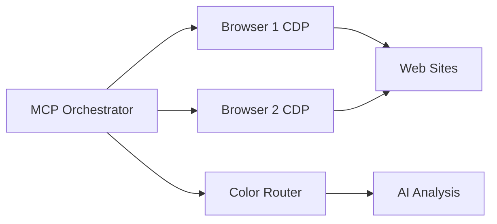

<div align="center">

# Browser MCP Orchestrator

**Dual-browser DevTools MCP orchestration with color-routed tab workers**

<br/>

[](#)
[](#)
[](#)
[](#)
[](#)
[](#)
[](#)
[](#actions-registry)
[](https://github.com/Turbo31150/jarvis-linux)

<br/>

<p><em>A browser orchestration layer that controls Chrome and Comet via Chrome DevTools Protocol (CDP). Instead of traditional web navigation, it injects directly into the DOM for instant execution -- zero page reloads.</em></p>

[**Architecture**](#architecture) · [**Color Routing**](#color-routing) · [**Features**](#features) · [**Actions**](#actions-registry) · [**Quick Start**](#quick-start) · [**Ecosystem**](#jarvis-ecosystem)

</div>

---


## Architecture



## Overview

Part of the [JARVIS OS](https://github.com/Turbo31150/jarvis-linux) ecosystem, the **Browser MCP Orchestrator** provides a unified interface to control multiple browser instances through the Chrome DevTools Protocol. Each browser tab becomes a specialized worker, routed by color-coded intent categories.

Key differentiator: **zero-reload DOM injection** -- actions execute directly in the page context without triggering navigation or page refreshes.

---

## Architecture

```
Intent -> Route (Color) -> Browser (Chrome/Comet) -> Tab (CDP) -> Action -> Result
```

### Detailed Flow

```
+------------+     +---------------+     +------------------+
| JARVIS     | --> | MCP           | --> | Route Dispatcher |
| Orchestrator|     | Protocol Layer|     | (Color Router)   |
+------------+     +---------------+     +--------+---------+
                                                  |
                                    +-------------+-------------+
                                    |                           |
                            +-------v-------+           +-------v-------+
                            | Chrome        |           | Comet         |
                            | CDP :9222     |           | CDP :9223     |
                            +-------+-------+           +-------+-------+
                                    |                           |
                            +-------v-------+           +-------v-------+
                            | Tab Registry  |           | Tab Registry  |
                            | Rouge | Bleu  |           | Vert tabs     |
                            | Jaune tabs    |           |               |
                            +---------------+           +---------------+
```

---

## Color Routing

| Color | Purpose | Browser | Port | Use Cases |
|-------|---------|---------|:----:|-----------|
| **Rouge** | Social | Chrome | 9222 | LinkedIn posts, Twitter engagement |
| **Bleu** | Trading | Chrome | 9222 | MEXC prices, GitHub Actions, TradingView |
| **Jaune** | Content | Chrome | 9222 | Content generation, SEO audits |
| **Vert** | Automation | Comet | 9223 | Email, Perplexity search, scraping |

---

## Features

| Feature | Description |
|---------|-------------|
| **Zero-reload DOM injection** | No page navigation, instant execution in page context |
| **Dual-browser control** | Chrome + Comet managed simultaneously |
| **Multi-tab workers** | Each tab is a specialized worker with dedicated purpose |
| **Tab registry** | Auto-synced from CDP every 30s, always up-to-date |
| **18 pre-built actions** | LinkedIn, MEXC, GitHub, Gmail, Perplexity, screenshots |
| **DevTools MCP specs** | Performance audit, SEO check, network scan, meta extraction |
| **Color routing** | Intent-based routing to the right browser and tab |
| **Domino integration** | Browser steps in JARVIS automation pipelines |
| **Screenshot capture** | Full-page and element-level screenshots |
| **Network monitoring** | Request/response interception and analysis |

---

## Actions Registry

### Social (Rouge)

| Action | Description |
|--------|-------------|
| `linkedin_post` | Navigate to LinkedIn post creation |
| `linkedin_paste_content` | Inject content into post editor |
| `linkedin_publish` | Publish the post |

### Trading (Bleu)

| Action | Description |
|--------|-------------|
| `mexc_check_price` | Extract current price from MEXC |
| `mexc_extract_orderbook` | Pull orderbook data |
| `tradingview_screenshot` | Capture chart screenshot |
| `github_navigate_repo` | Navigate to a repository |
| `github_check_actions` | Check CI/CD status |
| `github_extract_readme` | Extract README content |

### Automation (Vert)

| Action | Description |
|--------|-------------|
| `perplexity_search` | Execute search query |
| `gmail_check_inbox` | Check inbox status |
| `gmail_extract_unread` | Extract unread emails |
| `codeur_check_profile` | Check freelance profile |

### Generic

| Action | Description |
|--------|-------------|
| `generic_screenshot` | Full-page screenshot |
| `generic_extract_meta` | Extract page metadata |
| `generic_extract_links` | Extract all page links |
| `generic_extract_headings` | Extract heading structure |
| `generic_dom_inject` | Inject arbitrary JavaScript |

---

## Quick Start

```bash
# Start Chrome with CDP
google-chrome --remote-debugging-port=9222 --no-first-run

# (Optional) Start Comet with CDP
comet-browser --remote-debugging-port=9223

# Dispatch an action
from browser_orchestrator import BrowserOrchestrator

o = BrowserOrchestrator()
result = await o.dispatch("bleu", "navigate", {"url": "https://github.com"})
```

### Example: Multi-step automation

```python
o = BrowserOrchestrator()

# Check crypto price
price = await o.dispatch("bleu", "mexc_check_price", {"pair": "BTC/USDT"})

# Take TradingView screenshot
screenshot = await o.dispatch("bleu", "tradingview_screenshot", {"symbol": "BTCUSDT"})

# Post update to LinkedIn
await o.dispatch("rouge", "linkedin_post", {"content": f"BTC at {price}"})

# Search for analysis
analysis = await o.dispatch("vert", "perplexity_search", {"query": "BTC market analysis"})
```

---

## Configuration

| Parameter | Default | Description |
|-----------|---------|-------------|
| `CHROME_CDP_PORT` | 9222 | Chrome DevTools Protocol port |
| `COMET_CDP_PORT` | 9223 | Comet DevTools Protocol port |
| `TAB_SYNC_INTERVAL` | 30s | Tab registry refresh interval |
| `ACTION_TIMEOUT` | 10s | Default action timeout |
| `SCREENSHOT_FORMAT` | png | Screenshot output format |

---

## JARVIS Ecosystem

| Project | Description |
|---------|-------------|
| [jarvis-linux](https://github.com/Turbo31150/jarvis-linux) | Distributed Autonomous AI Cluster |
| **browser-mcp-orchestrator** | Dual-Browser DevTools Orchestration *(this repo)* |
| [github-social-automation](https://github.com/Turbo31150/github-social-automation) | GitHub Social Automation via Comet Bridge |
| [TradeOracle](https://github.com/Turbo31150/TradeOracle) | Autonomous Crypto Trading Agent |
| [lumen](https://github.com/Turbo31150/lumen) | Multilingual Live AI Web App |


## What is Browser MCP Orchestrator?

Automate any web workflow using two browsers simultaneously. While Browser 1 scrapes data, Browser 2 can fill forms — both controlled by MCP (Model Context Protocol) and Chrome DevTools.

Built for JARVIS OS to handle tasks like: scanning Codeur.com for projects, posting on LinkedIn, and managing multiple web sessions in parallel.

## Usage Examples

```python
# Example 1: Scrape + act in parallel
browser1.navigate("https://codeur.com/projects")  # Scrape
browser2.navigate("https://linkedin.com/feed")     # Post

projects = browser1.extract_data()
browser2.post_comment(generate_comment(projects))

# Example 2: Form automation
browser1.navigate("https://codeur.com/offers/new")
browser1.fill("#amount", "750")
browser1.fill("#message", proposal_text)
browser1.click("#submit")

# Example 3: Screenshot verification
browser1.screenshot("/tmp/result.png")
# → Verify the action was successful
```

## Use Cases

| Workflow | Description |
|----------|-------------|
| **Freelance prospection** | Scan Codeur → filter → auto-apply |
| **LinkedIn engagement** | Read notifications → draft replies → post |
| **Price monitoring** | Track prices across multiple sites |
| **Form filling** | Auto-fill applications, registrations |
| **Data extraction** | Scrape tables, lists, structured data |

---

<div align="center">

**Built by [Franck Delmas](https://github.com/Turbo31150)** · Toulouse, France

*Browser MCP Orchestrator -- MIT License*

> Freelance profile: [codeur.com/-6666zlkh](https://www.codeur.com/-6666zlkh)

</div>
